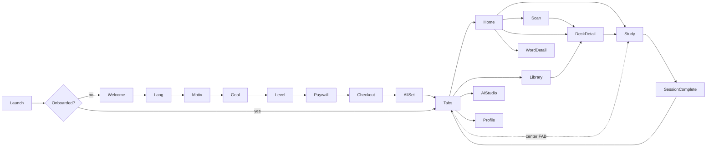

# Vocably — iOS Build Handoff

> Implementation spec for building **Vocably**, a native iOS vocabulary-learning app, from the finished Paper designs. Written for a developer/AI agent who will write the code. Read §1–§5 first, then build per §11 and §14.

---

## 1. How to use this document

- **Designs live in Paper:** `https://app.paper.design/file/01KW03XFEJP9EVDNM2VYTC9SH4/1-0`
- The design **tokens, components, and screen specs are embedded below** so you can build the whole UI **without opening Paper**. Open Paper only to pull exact pixel values or export assets.
- If you have the **Paper MCP** tools, extract exact values per screen:
  - `get_jsx({ nodeId })` → JSX + styles for a screen/component
  - `get_computed_styles({ nodeIds: [...] })` → precise CSS values
  - `get_screenshot({ nodeId })` → visual reference (do **not** read sizes from screenshots; use computed styles)
  - `get_fill_image({ nodeId })` / `export` → image/icon assets
  - `get_tokens({ format: "json" })` → the token set (also embedded in §5)
- Node IDs for every screen are in **§11**.

---

## 2. Product summary

Vocably teaches vocabulary in any language. Core loop: **review due words via a swipeable flashcard deck** scheduled by spaced repetition. Words come from **manual entry, OCR camera scan, or AI generation**. Supporting surfaces: home dashboard, deck library, word detail, profile/stats, full onboarding, and a Pro subscription paywall + checkout.

**Feature list**
1. Swipe study (flashcards + spaced repetition)
2. OCR scan → capture words from real text + translate
3. AI deck generation (prompt → words, translations, examples, mnemonics)
4. Word detail (definition, IPA, audio, examples, AI memory hook)
5. Decks/library (create, browse, discover premade)
6. Home dashboard (streak, daily goal, continue, decks)
7. Profile/stats (streak, level/XP, achievements, settings)
8. Onboarding (8 steps) + Pro paywall + checkout
9. Session-complete summary

---

## 3. Tech stack & targets

| Concern | Choice |
|---|---|
| UI | SwiftUI (UIKit bridge only for camera/DataScanner) |
| Min iOS | **17.0** (gate iOS 18/26 AI behind `#available` with fallbacks) — *confirm with product owner* |
| State | Observation (`@Observable`), MV pattern |
| Persistence | SwiftData |
| Sync | SwiftData + CloudKit private DB |
| AI | Foundation Models (on-device, iOS 26+) **+** server-LLM fallback |
| Translation | Translation framework + NaturalLanguage |
| OCR | VisionKit `DataScannerViewController` / Live Text |
| TTS | AVSpeechSynthesizer |
| Charts | Swift Charts |
| Payments | StoreKit 2 (optionally RevenueCat) |
| Auth | Sign in with Apple |

**Required accounts:** Apple Developer Program ($99/yr). **Build machine:** macOS + Xcode (mandatory for any iOS build/signing).

**Third-party deps:** prefer zero. Allowed if justified: RevenueCat (only if cross-platform billing needed). Everything else first-party.

---

## 4. Repository / module structure (Swift Packages)

```
Vocably/                      App target — composition root, App, AppIntents, entitlements
  Vocably.entitlements        iCloud/CloudKit, Sign in with Apple, push, App Groups
Packages/
  DesignSystem/               Tokens, fonts, SF Symbol map, components (§5, §6)
  Models/                     SwiftData entities + CloudKit config (§7)
  SRSEngine/                  Pure-Swift scheduler, fully unit-tested (§9)
  Services/                   Protocols + Live + Mock: AI, Scan, Translate, Speech, Store, Reminders, Sync (§8)
  Features/
    Onboarding/  Home/  Study/  Scan/  AIStudio/  Library/  WordDetail/  Profile/  Paywall/
  VocablyWidgets/             WidgetKit + ActivityKit (§12)
Tests/                        Unit + snapshot + UITest targets
```

Rules: `SRSEngine` and `Models` import **no SwiftUI**. Features depend on `DesignSystem`, `Models`, `Services`, `SRSEngine` — never on each other. Services expose **protocols**; Features take them via init for previews/tests.

---

## 5. Design system (tokens → code)

Source palette/mood: **botanical "bone × moss"** — warm paper ground, deep moss accent, honey amber secondary, clay rose for negative/again. Fonts: **Fraunces** (serif display + vocabulary words), **Inter** (all UI). Both must be bundled (or substitute **SF Pro** for UI and keep Fraunces for display only — confirm with owner; bundling Fraunces/Inter requires Dynamic Type tuning).

### 5.1 Colors (light) → Asset Catalog color set names

| Token / asset name | Hex | Role |
|---|---|---|
| `background` | `#F4F1E8` | App background (bone) |
| `surface` | `#FBF9F3` | Raised surface |
| `surfaceBright` | `#FFFFFF` | Elevated cards/study card |
| `ink` | `#21241D` | Primary text |
| `muted` | `#767A6C` | Secondary text |
| `faint` | `#A6A99B` | Tertiary text / icons |
| `line` | `#E6E2D6` | Hairlines / borders |
| `onPrimary` | `#F4F1E8` | Text/icons on moss |
| `primary` | `#34553B` | Moss — primary accent |
| `primaryStrong` | `#284230` | Pressed moss |
| `primarySoft` | `#E2E8D7` | Pale moss fills/chips |
| `accent` | `#C68A36` | Honey — streaks/highlights |
| `accentSoft` | `#F1E5CC` | Pale honey fill |
| `rose` | `#B05B45` | Clay — "still learning"/again |

### 5.2 Colors (dark) — used by Home·B & Swipe·B; provide as the `.dark` variant of each asset

| Role | Value |
|---|---|
| background | `#15170E` (warm near-black) |
| surface (card) | `rgba(255,255,255,0.05)` over bg |
| line/border | `rgba(255,255,255,0.08)` |
| elevated hero | `#20241A` |
| primary action (brighter moss on dark) | `#7DA878` (filled) / `#4E7B57` |
| text primary / secondary | `#FFFFFF` / `rgba(255,255,255,0.6)` |
| accent | `#C68A36` (unchanged) |

Implement as semantic colors in an asset catalog with light+dark; expose via `Color.vocably.primary` etc. Do **not** hardcode hex in views.

### 5.3 Type scale (px → use as points; map to Dynamic Type styles)

`xs 12 · sm 14 · base 16 · lg 18 · xl 22 · 2xl 28 · 3xl 36 · 4xl 48 · 5xl 64`
Weights: `regular 400 · medium 500 · semibold 600 · bold 700 · black 900`.
Tracking: `tight -0.02em (large display) · normal 0 · wide 0.08em (small caps labels)`.
Leading: `tight 1.1 · snug 1.3 · normal 1.5`.

Map each to a `Font.TextStyle` for Dynamic Type, e.g. display headings → `.largeTitle`/`.title` scaled with Fraunces; body → `.body` with Inter; captions/labels (uppercase, wide tracking) → `.caption`. Cap display sizes so XXL accessibility sizes don't break layout.

### 5.4 Radius & spacing

Radius: `sm 10 · md 16 · lg 24 · xl 32 · full 999`. Spacing scale (pt): `4 · 8 · 12 · 16 · 20 · 24 · 32 · 40 · 48`.

### 5.5 Icons
- System glyphs → **SF Symbols** (don't recreate the hand-drawn SVGs).
- Brand mark (leaf), language **flags**, and the wordmark → bundle as assets / `Image`. Export flags from Paper or rebuild as small `Shape`s.
- Status bar: use the **real system status bar** (the Paper status-bar SVG is mockup-only — delete it).

### 5.6 Reference: starter Swift theme
```swift
enum Space { static let s1=4.0, s2=8.0, s3=12.0, s4=16.0, s5=20.0, s6=24.0, s8=32.0, s10=40.0, s12=48.0 }
enum Radius { static let sm=10.0, md=16.0, lg=24.0, xl=32.0, full=999.0 }
extension Color { static let vocably = VocablyColors() }
struct VocablyColors { let primary = Color("primary"); /* …asset-catalog backed… */ }
```

---

## 6. Reusable component inventory

Build these in `DesignSystem` first (with SwiftUI previews + snapshot tests). Pull exact metrics via `get_computed_styles`.

| Component | Spec essentials |
|---|---|
| `PrimaryButton` | moss pill, height 54–56, radius full, `onPrimary` label 16–17 semibold, soft moss shadow; pressed → `primaryStrong`; supports trailing SF Symbol |
| `SecondaryButton` / `GhostButton` | surface bg + `line` border, ink label; ghost = transparent |
| `Chip` | pill, selectable; states: default (surface+line, muted), selected (primarySoft bg + primary border + check) |
| `DeckRow` | 44pt rounded mark (lang code, colored) + title/subtitle + trailing **ProgressRing(40pt)** with % label; fixed trailing lane |
| `ProgressRing` | SVG-equivalent: track `line` + progress `primary`, rounded cap, center label (Fraunces); sizes 40 & 188 |
| `ProgressBar` | 6–8pt track `line`, fill `primary`/`accent` |
| `SegmentedProgress` | N equal segments, filled = primary (onboarding step indicator) |
| `StatTile` / `StatStrip` | number (Fraunces) + label (Inter, muted); strip = 3 columns with dividers |
| `SurfaceCard` | radius 18–28, `surface`/`surfaceBright`, `line` border, subtle shadow `rgba(33,36,29,0.05–0.13)` |
| `Flashcard` | front/back, big Fraunces word, IPA, POS chip, speaker, answer block; stack uses 2 offset/rotated cards behind |
| `TabBar` | 5 items (Home, Decks, **center Study FAB**, AI, Profile); active = primary, inactive = faint; FAB raised −14pt, moss, shadow. Provide light + dark. Prefer native `TabView`; the center FAB can be a custom overlay or a real tab with a styled label |
| `OptionRow` | icon square + title/subtitle + radio (selected = filled moss + check); used by Goal & Level |
| `PlanCard` | radio + title/sub + price col; selected = primarySoft + primary border + badge |
| `FormField` | label (uppercase wide) + input box (surfaceBright + line, 52pt) |
| `StreakWeek` | 7 day-dots (done=moss+check, today=accent ring, future=faint) + label |
| `MemoryHookCard` | primarySoft bg, sparkle + "AI memory hook" + body |

---

## 7. Data model (SwiftData)

```swift
@Model final class UserProfile {
  var name: String
  var avatarInitial: String
  var learningLanguage: String        // e.g. "es"
  var nativeLanguage: String          // e.g. "en"
  var dailyGoalMinutes: Int           // 5/10/15/30
  var motivations: [String]           // travel, career, …
  var startingLevel: Int              // 0 new … 3 advanced
  var streakCount: Int
  var bestStreak: Int
  var xp: Int
  var level: Int
  var proEntitlement: Bool
  // relationships: decks, dailyActivity
}

@Model final class Deck {
  var id: UUID
  var name: String
  var languageCode: String
  var level: String                   // "A2"
  var colorTokenName: String          // "primary"/"accent"/"rose" for the mark
  var source: String                  // manual/ai/scan/premade
  var createdAt: Date
  @Relationship(deleteRule: .cascade) var cards: [Card]
}

@Model final class Card {
  var id: UUID
  var term: String                    // "la mariposa"
  var translation: String             // "butterfly"
  var ipa: String?
  var partOfSpeech: String?           // "noun · feminine"
  var example: String?
  var exampleTranslation: String?
  var mnemonic: String?               // AI memory hook
  var source: String                  // manual/ai/scan
  @Relationship(deleteRule: .cascade) var review: Review?
}

@Model final class Review {            // SRS scheduling state, device-authoritative
  var due: Date
  var intervalDays: Double
  var ease: Double                    // SM-2 default 2.5
  var reps: Int
  var lapses: Int
  var lastRating: Int?                // 0 again …3 easy
  var masteryLevel: Int               // 0–3 → the 3 mastery dots
}

@Model final class DailyActivity {     // streak calendar + widget feed
  var date: Date
  var wordsReviewed: Int
  var minutes: Int
  var goalMet: Bool
}
```

CloudKit: enable for all entities except keep `Review` conflict resolution last-writer-wins by `due`. Add `@Attribute(.unique)` on `id`s.

---

## 8. Services (protocols)

Define in `Services` with `Live` + `Mock` impls. Inject into features.

```swift
protocol AIService {
  // Generate a deck draft from a topic. Streamed for the AI Studio screen.
  func generateDeck(prompt: String, language: String, level: String,
                    count: Int) async throws -> [CardDraft]
  func mnemonic(for term: String, translation: String) async throws -> String
  func examples(for term: String, language: String) async throws -> [Sentence]
}
// Live: FoundationModels (iOS26+, @Generable structs); fallback: ServerLLM (REST). Pick at runtime via availability.

protocol ScanService {                 // VisionKit
  func scanText() -> AsyncStream<[RecognizedWord]>   // live frames, tappable words
}

protocol TranslateService {            // Translation + NaturalLanguage
  func translate(_ text: String, from: String, to: String) async throws -> String
  func lemmatize(_ text: String, language: String) -> [String]
}

protocol SpeechService { func speak(_ text: String, language: String) }   // AVSpeechSynthesizer

protocol StoreService {                // StoreKit 2
  var status: SubscriptionStatus { get }            // @Observable
  func products() async throws -> [SubscriptionProduct]
  func purchase(_ id: String) async throws -> Bool
  func restore() async throws
}

protocol ReminderService {             // UserNotifications
  func scheduleDailyReminder(at: DateComponents) async
  func scheduleStreakNudge() async
}
```

---

## 9. Spaced-repetition engine (`SRSEngine`)

Pure Swift, no I/O. Start with **SM-2**; keep `Scheduler` a protocol so **FSRS** can replace it.

- **Rating mapping (from swipe/buttons):** swipe-left / "Still learning" → **Again (0)**; "Hard" → 1; swipe-right / "I know it"/"Got it" → **Good (2)**; "Easy" → 3.
- **`func schedule(_ review: Review, rating: Int, now: Date) -> Review`** updates `ease`, `intervalDays`, `reps`, `lapses`, `due`, `masteryLevel`.
- "Due today" = `review.due <= startOfTomorrow`. Drives Home counts, Deck Detail "12 due", and `ReminderService`.
- 100% unit-test coverage on the scheduler (table-driven cases).

---

## 10. Navigation & flow



- **Onboarding** is a full-screen flow gated by a `hasOnboarded` flag.
- **Tabs**: Home · Decks · Study(center) · AI · Profile.
- **Modally presented** (`.sheet`/`.fullScreenCover`): Scan, Study session, Word detail, Paywall, Session complete.
- Use `NavigationStack` per tab; deep-link targets: deck, word, "start review".

---

## 11. Screen specs (with Paper node IDs)

Each screen: open the Paper node for exact layout; build per the notes. Acceptance = matches design at default Dynamic Type, light+dark where applicable, no clipping at 390×844.

### Onboarding
| Screen | Node | Notes |
|---|---|---|
| Welcome | `10Q-0` | Moss full-bleed, brand, floating multilingual chips, "Get started" / "Log in" (Sign in with Apple) |
| Language | `EL-0` | 2-col flag grid, single-select, "placement test" upsell row, Continue |
| Motivation | `11U-0` | Back + 4-seg progress; 6 multi-select cards; Continue |
| Daily Goal | `14B-0` | 4 option rows w/ intensity bars; "Popular" badge; sets `dailyGoalMinutes` |
| Level | `180-0` | 4 option rows w/ level bars; sets `startingLevel` |
| Paywall | `1B6-0` | Pro emblem, 4 feature checks, **Yearly (free trial) vs Monthly** plan cards, social proof, StoreKit purchase |
| Checkout | `1DN-0` | Order summary (Due today $0), **Apple Pay** + card form, "Start free trial". *If using StoreKit subscription sheet, this screen is optional/illustrative — confirm.* |
| All Set | `1FV-0` | Celebration + choices summary; "Start learning" → Tabs |

### Core app
| Screen | Node | Notes |
|---|---|---|
| **Home** (default) | `1-0` | Header (greeting + scan button + avatar), StreakWeek, moss Continue card, decks, tab bar |
| Home variant A (Ring) | `VQ-0` | Alternate: big goal ring hero. *Pick one home; A recommended for focus, default `1-0` for density.* |
| Home variant B (Dark) | `Y0-0` | Alternate dark dashboard — reuse as the dark-mode treatment reference |
| **Swipe Study** (default) | `3H-0` | Card stack, reveal answer, swipe Again(rose)/Know(moss) mirrored buttons, progress, undo. Drag gesture + rotation + overlays + haptics |
| Swipe variant A (Minimal) | `SK-0` | Alternate: single tilted card, edge hints, gesture-first |
| Swipe variant B (Focus) | `U6-0` | Alternate: dark focus mode, big split buttons |
| OCR Scan | `5J-0` | DataScanner camera, captured-page word highlights, results sheet (`.presentationDetents`), translate chips, "Add N to deck" |
| AI Generate | `7U-0` | Prompt composer, suggestion chips, streamed result rows (term/translation/example), "Add N to my decks" |
| Word Detail | `AD-0` | Big word, IPA + Listen (TTS), meaning, examples, **AI memory hook**, Known/Practice actions |
| Library / Decks | `H2-0` | Title + create, `.searchable`, filter chips, deck rows, Discover horizontal cards, tab bar (Decks active) |
| Deck Detail | `KC-0` | Moss hero (name/progress), 3 stats, word list w/ mastery dots, pinned "Study N due" |
| Profile / Stats | `NE-0` | Identity + level, lifetime stats, Level/XP card, achievements, settings list, tab bar (Profile active) |
| Session Complete | `R1-0` | Medal + confetti, result stats grid, streak +1, Keep going / Review missed |

> **Variants:** ship **one** Home and **one** Swipe Study as canonical; keep the others as design references (dark mode, alternate study mode toggle). Recommend default Home `1-0` + Swipe `3H-0`; offer Swipe·B as an optional "Focus mode" toggle later.

---

## 12. System integrations (native feel)

| Integration | Framework | Scope |
|---|---|---|
| Home/Lock widgets (streak, due count, word of day) | **WidgetKit + App Intents** | Interactive: tap → start review |
| Live study progress | **ActivityKit** (Live Activity + Dynamic Island) | Session %, streak countdown |
| Siri / Shortcuts | **App Intents** | "Start my Spanish review", "Scan a word"; donate for Spotlight |
| Reminders | **UserNotifications** | Daily goal time (from onboarding), streak-save nudge; actionable "Review now" |
| Background refresh | **BGTaskScheduler** | Recompute due counts, refresh widgets/timeline |
| Search | **Core Spotlight** | Index decks + words; deep link in |
| Auth | **Sign in with Apple** + Keychain | Login on Welcome |
| Subscriptions | **StoreKit 2** | Paywall products `pro.monthly`, `pro.yearly` (intro trial); entitlement gate |
| Study-together (later) | **SharePlay / GroupActivities** | Optional |
| Haptics | **Core Haptics / `.sensoryFeedback`** | Swipe commit, correct/incorrect, milestones |

---

## 13. Native-feel & accessibility (required, not optional)

- **Dynamic Type** on every text; layouts reflow (no clipping) up to XL.
- **Dark Mode** parity (designs in `Y0-0`/`U6-0` show intended dark treatment).
- **VoiceOver**: card term/translation labeled; swipe outcomes exposed as accessibility actions ("Mark known", "Still learning").
- **Reduce Motion** → cross-fade instead of card-throw; **Reduce Transparency**, **Increase Contrast**, **Bold Text** honored.
- **SF Symbols** + **localized String Catalogs** (`.xcstrings`); RTL-ready.
- Native `NavigationStack`, swipe-back, `.sheet` detents, context menus, pull-to-refresh where natural.

---

## 14. Build phases & milestones

| Phase | Deliverable | Exit criteria |
|---|---|---|
| **0 Foundation** | Xcode project, SPM modules, DesignSystem (tokens/fonts/components), SwiftData schema, CI (Xcode Cloud/Codemagic) | Component gallery renders light+dark; previews green; CI builds |
| **1 Core loop** | SRSEngine, Decks, Swipe Study, Home | Create deck → review with scheduling, haptics, session complete |
| **2 Capture & AI** | OCR Scan, AI Generate, Word Detail + TTS, Translation | Scan→add; prompt→deck offline (Foundation Models) or fallback |
| **3 Onboarding & Paywall** | 8-step onboarding, StoreKit 2, Sign in with Apple | Trial purchasable in sandbox; Pro gates content |
| **4 System integration** | Widgets, Live Activity, Siri/App Intents, Notifications, Spotlight | Streak widget + reminder + "Start review" Shortcut work |
| **5 Polish & a11y** | Dynamic Type, VoiceOver, dark mode, localization, Profile/Charts | Accessibility audit passes |
| **6 QA & ship** | Tests, TestFlight, App Store assets, privacy labels | Beta stable; submission-ready |

---

## 15. Definition of done & testing

- Each screen: matches Paper at default text size, light+dark, no clip at 390×844; states (empty/loading/error/selected) handled.
- **Tests:** SRSEngine unit (table-driven, 100%); Services via Mocks; DesignSystem snapshot; XCUITest for review loop + sandbox purchase.
- Performance: swipe deck holds 60/120fps (Instruments); scan first-result < 1s.
- No force-unwraps in domain; all async errors surfaced to UI.

---

## 16. Assumptions & open decisions (confirm before Phase 0)

1. **Min iOS = 17** (AI gated) vs 18+ (simpler). *Default: 17.*
2. **Backend?** CloudKit-only to start vs custom server (needed for leaderboards/social like Profile's "Top 8% this week", and for the server-LLM fallback). *Default: CloudKit + a thin AI-proxy endpoint only.*
3. **AI** = on-device Foundation Models + server fallback vs single server LLM. *Default: hybrid.*
4. **Fonts**: bundle Fraunces+Inter vs SF Pro for UI + Fraunces display only. *Default: bundle both, tune Dynamic Type.*
5. **Checkout screen** (`1DN-0`): custom card form vs native StoreKit subscription sheet (Apple handles payment — custom card UI is usually unnecessary and may violate guidelines for digital goods). *Default: use StoreKit; keep `1DN-0` as visual reference only.*
6. **Variants**: confirm canonical Home (`1-0`) and Swipe (`3H-0`).

> ⚠️ App Store note: digital subscriptions **must** use StoreKit/IAP; do not ship the custom credit-card form (`1DN-0`) as the real payment path for Pro.
